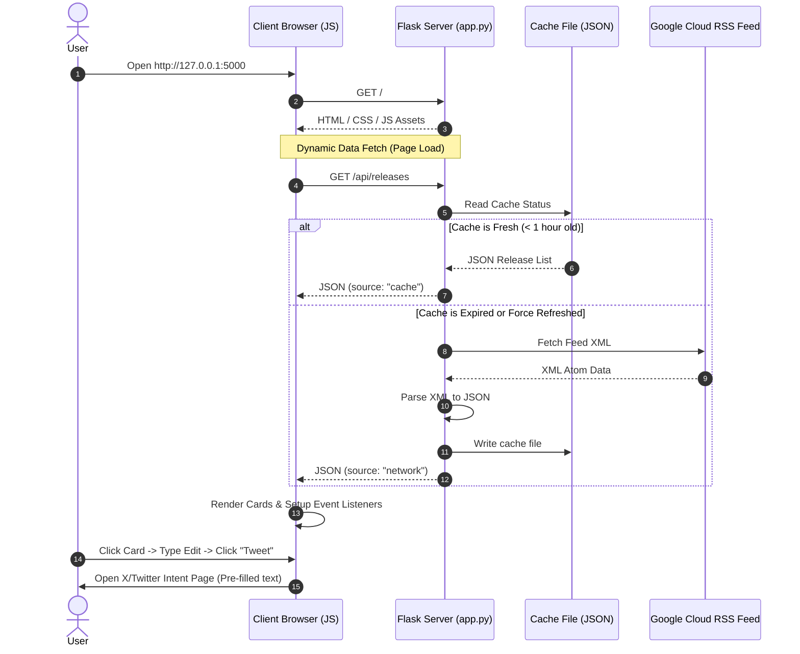

# BigQuery Releases Technical Breakdown & Architecture

This document provides a detailed breakdown of the application architecture, separates the responsibilities of the Client and Server, traces dynamic request-response lifecycles, and reviews the implementation of the Flask backend code.

---

## 🏛️ System Architecture Overview

The system is organized into a decoupled client-server architecture where the server operates as an API Gateway and local data cacher, and the client operates as a rich, single-page state machine.



---

## 📡 Server-Side Design

The server-side operates inside `app.py`. Its key responsibilities are:
1. **HTML Serving**: Render the main application interface template.
2. **RSS Aggregation**: Fetch raw XML feed from Google Cloud.
3. **Semantic Parsing**: Break raw XML blocks into discrete updates by categories (Feature, Changed, Deprecated).
4. **Caching & Resiliency**: Keep local cache JSON to guarantee speed and offline fallback if network calls fail.

---

## 💻 Client-Side Design

The client-side operates inside `templates/index.html`, `static/css/style.css`, and `static/js/main.js`. Its key responsibilities are:
1. **Interactive Styling**: Responsive layout grids, radial ambient background glow filters, neon category indicator borders, and modern geometric typography.
2. **State Management**: Keep track of the active categories and selected release card.
3. **Event Routing**: Update the detail pane and pre-compose character-counted tweets instantly on clicking an update card.
4. **Sharing Broker**: Check character counts against X's 280-character constraints and format URL-safe Web Intents to launch posts.

---

## 🕵️ Detailed Breakdown of `app.py`

Here is a line-by-line logical analysis of `app.py`:

### 1. Imports and Configurations (Lines 1-12)
```python
import os
import time
import urllib.request
import feedparser
from bs4 import BeautifulSoup
from flask import Flask, jsonify, render_template, request

app = Flask(__name__)

FEED_URL = 'https://docs.cloud.google.com/feeds/bigquery-release-notes.xml'
CACHE_FILE = 'releases_cache.json'
CACHE_EXPIRY = 3600  # 1 hour in seconds
```
- **Libraries**: `feedparser` parses RSS/Atom feeds, `bs4.BeautifulSoup` parses and navigates XML/HTML tags, and standard library tools `urllib` and `time` manage fetch and caching times.
- **`CACHE_EXPIRY`**: Avoids overloading Google Cloud's server with identical feed requests by caching data locally for 1 hour.

### 2. Cache Utility Methods (Lines 14-38)
- **`get_empty_cache_structure`**: Instantiates the schema for a fresh cache if no cache file exists.
- **`read_cache`**: Reads cached results from `releases_cache.json`. If it does not exist or fails to open, returns an empty structure safely.
- **`write_cache`**: Saves new parsed data to `releases_cache.json` formatted with `ensure_ascii=False` to preserve special Unicode formatting characters.

### 3. XML Feed Parser (Lines 39-94)
- **`parse_feed_content`**:
  - Iterates over each `<entry>` block.
  - Inspects the `<content>` field which contains an HTML block.
  - Google's Atom updates group multiple items inside a single date post separated by `<h3>` tags (e.g. `<h3>Feature</h3><p>...</p><h3>Changed</h3><p>...</p>`).
  - The parsing code searches for all `<h3>` elements.
  - If no `<h3>` exists, it defaults to a general block.
  - If they do exist, it collects all subsequent sibling elements until it hits the next `<h3>` tag.
  - It compiles the collected elements back into valid HTML using a secondary BeautifulSoup shell.
  - Each item is converted into an object containing unique IDs (`entry_idx_h3_idx`), date titles, categories, raw HTML, and plain text.

### 4. Feed Retrieval (Lines 96-104)
- **`fetch_and_parse_feed`**:
  - Creates a `urllib.request.Request` wrapper.
  - Injects a standard browser User-Agent header to prevent Google servers from blocking the request as an unverified script.

### 5. API Endpoint Controller (Lines 110-155)
- **`get_releases`**:
  - Accepts a query parameter `force_refresh=true`.
  - Checks if the cache has expired by comparing time offsets.
  - If a refresh is forced or the cache is expired:
    - Attempts to pull raw data via `fetch_and_parse_feed`.
    - If it succeeds, it writes to the cache and serves a `'status': 'success', 'source': 'network'` response.
    - If the fetch fails (e.g. offline, rate-limited) but a local cache is found, it falls back to cached data but sends a `'status': 'warning'` indicating it's using cache fallback.
  - If cache is valid, it reads and returns from cache immediately (`source: 'cache'`).

---

## 🔄 Sample Request/Response Lifecycle Traces

Let's review what happens on different user actions:

### Flow A: The Initial Page Load
1. The browser requests `http://127.0.0.1:5000/`.
2. Flask serves the statically rendered HTML file `index.html`.
3. The browser pulls `style.css` and `main.js`.
4. As soon as DOM content loads, `main.js` makes a `fetch('/api/releases')` request.
5. While waiting, `main.js` injects animated gray skeleton loading blocks in place of cards.
6. The backend server checks `releases_cache.json`. If it's fresh, it responds instantly with JSON.
7. JavaScript parses the JSON, strips out the skeleton loaders, and renders clickable card objects. It updates the header indicator showing "Last updated: HH:MM (Cached)".

### Flow B: Refresh Button Click (Manual Refresh)
1. The user clicks the **Refresh** button in the header.
2. JavaScript intercepts this, adds a `.loading` spin animation class, and runs `fetch('/api/releases?force_refresh=true')`.
3. The Flask backend bypasses the time check and sends a live HTTP request to Google Cloud's servers.
4. If successful, Flask overwrites `releases_cache.json` with the new data, and returns it.
5. JavaScript parses the new release entries, replaces the active cards in-place with a smooth transition, updates the header text to "Last updated: HH:MM (Fresh)", and terminates the spinner animation.

### Flow C: Selection and Sharing a Tweet
1. The user clicks a release card marked as **Feature**.
2. Javascript intercepts the click, sets the card state to `.active` (adding a green neon glow border), hides the empty-state sidebar panel, and populates the details panel.
3. JavaScript parses the title, date, plain text, and source link anchor URL.
4. The helper function `populateTweetComposer` formats the share text:
   - Evaluates remaining space (`280` minus hashtags, links, and formatting templates).
   - Truncates the text snippet safely and appends `...`.
   - Populates the Tweet composer text area with the formatted draft.
5. If the user edits the text, character counters update in real-time. If they exceed 280 characters, the composer counter text glows red and the "Tweet on X" button gets disabled.
6. When the user clicks "Tweet on X", JavaScript reads the textarea content, encodes it into a URL-safe format via `encodeURIComponent()`, and runs `window.open("https://twitter.com/intent/tweet?text=...")` opening a browser page pre-loaded with the post content.
